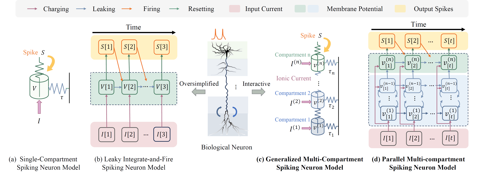

# Parallel Multi-compartment Spiking Neuron (PMSN)

Official implementation of **PMSN: A Parallel Multi-compartment Spiking Neuron for Multi-scale Temporal Processing**, accepted for publication in **IEEE Transactions on Neural Networks and Learning Systems (TNNLS)**.

<p align="center">
  <a href="[https://arxiv.org/abs/2408.14917](https://ieeexplore.ieee.org/abstract/document/11604167)">
  
  </a>
  <a href="https://arxiv.org/abs/2408.14917">
  
</p>

<p align="center">
  
</p>

## Overview

PMSN is a generalized multi-compartment spiking neuron designed for efficient multi-scale temporal processing. It incorporates interactions among neuronal compartments while supporting parallel training across time.


Key features include:

- **Multi-scale temporal modeling** through interacting neuronal compartments.
- **Flexible compartment number** for tasks with different temporal complexities.
- **Parallelized temporal computation** for substantially faster GPU training.
- **Strong performance** across sequential vision, neuromorphic audio, and large-scale image classification benchmarks.


## Repository Layout

| Directory | Experiment | Main entry |
| --- | --- | --- |
| `S-MNIST/` | Sequential MNIST and permuted sequential MNIST | `MNIST_PMSN.py` |
| `seqcifar1024/` | Sequential CIFAR-10 with length-1024 sequences | `CIFAR_PMSN.py` |
| `seqcifar32/` | Sequential CIFAR-10/100 row-wise processing | `CIFAR32_PMSN.py` |
| `SHD/` | Spiking Heidelberg Digits | `SHD_PMSN.py` |
| `imagenet/` | ImageNet with PMSN SEW-ResNet | `train_PMSN.py` |

Each experiment directory includes a one-line `run.sh` example.

## Quick Start

Install the dependencies used by the scripts, including PyTorch, torchvision, einops, tqdm, h5py, and SpikingJelly for ImageNet experiments.

Run one experiment from its directory:

```bash
cd seqcifar1024
bash run.sh
```

Dataset paths are configurable from the command line:

```bash
python CIFAR_PMSN.py --data_path /path/to/datasets
python MNIST_PMSN.py --data_path /path/to/datasets
python SHD_PMSN.py --data_path /path/to/SHD
python train_PMSN.py --data-path /path/to/imagenet
```

